# NaturePanelForge

NaturePanelForge is a code-first workflow for turning scientific figure images and open-access Nature-family papers into panel-level, executable plotting-code reconstruction tasks.

It has two core goals:

- Extract Nature-level full figures into reviewed, metadata-rich scientific panels.
- Reproduce selected statistical panels as editable Python plotting code, then polish them through a final review loop.

Maintainer-hosted gallery demo:

```text
http://166.111.35.177:18081/
```

The repository does not depend on this hosted demo. You can also serve your own exported gallery locally.




For the project introduction, methods, current dataset counts, Qwen score distributions, and Codex refine complexity distribution, see [Introduction and Methods](docs/intro_and_methods.md).

## Agent Workflow

NaturePanelForge uses three executable agent stages. Each stage writes machine-checkable artifacts and can be resumed.


**Panel Split** converts a compound full figure into complete panel crops. A split agent writes executable crop/spec logic, and a review agent checks panel letters, axis labels, ticks, legends, colorbars, titles, annotations, and edge visibility.

**Code Reproduce** turns a target panel into `reproduce_panel.py`, `reproduce_panel.png`, and `reproduce_panel.pdf`. A code-writing agent renders the plot, and a review agent compares the output against `target.png`; fixable issues trigger code edits and rerendering.

**Final Refine** starts from first-pass reproductions that already passed review. A polish agent edits the existing code, while an audit agent checks Arial typography, label/tick/legend overlap, scientific symbols, edge clipping, compactness, complexity score, and caption-based description.


## Public Modes

Use `forge.py` for the four public workflows:

```bash
python3 forge.py single-panel-image --image /path/to/target_panel.png --out-root UserRuns/panel_demo
python3 forge.py single-full-image --image /path/to/full_figure.png --out-root UserRuns/full_demo
python3 forge.py single-paper --doi 10.1038/s41467-025-12345-6 --download-only
python3 forge.py batched-paper --subject biology --topic AI_biology --target-papers 20 --batch-size 20
```

`single-panel-image` is the direct user-facing image-to-code path. A live run returns:

```text
target.png
metadata.json
qwen_score.json
reproduce_panel.py
reproduce_panel.png
reproduce_panel.pdf
user_reproduce_summary.json
result.json
```

`user_reproduce_summary.json` and `result.json` include the generated code text, output paths, review status, missing-output checks, and whether the live contract passed. Dry-runs intentionally set `live_contract_checked=false` and `contract_passed=false`.

## Quick Start

```bash
cd NaturePanelForge
python3 -m venv .venv
source .venv/bin/activate
pip install -r requirements.txt
cp configs/demo.env.example .env
source .env
```

Required external pieces:

- network access for paper and figure download
- Codex CLI for panel splitting, reproduction, and refine
- local Qwen vision model for panel classification/scoring

Check Codex:

```bash
codex --version
```

Set Qwen:

```bash
export QWEN_MODEL_PATH=/path/to/Qwen3.6-27B
export CUDA_VISIBLE_DEVICES=0
```

The default Qwen path is local `transformers` loading through `--qwen-backend transformers`. `--qwen-backend openai` is only an optional compatibility hook for users who intentionally run an OpenAI-compatible vision endpoint.

## Single Panel To Code

```bash
python3 forge.py single-panel-image \
  --image /path/to/target_panel.png \
  --panel-id demo_panel \
  --chart-type bar \
  --caption "A grouped bar chart with error bars and a legend." \
  --out-root UserRuns/demo_panel \
  --model gpt-5.4 \
  --reasoning-effort medium \
  --review-rounds 4 \
  --skip-existing
```

Dry run:

```bash
python3 forge.py single-panel-image \
  --image /path/to/target_panel.png \
  --out-root UserRuns/dry_run \
  --dry-run \
  --print-command
```

## Full Pipeline Demo

Run a small two-paper workflow:

```bash
TARGET_PAPERS=2 FIGURES_PER_PAPER=2 bash scripts/run_full_pipeline.sh
```

Scale to a production batch by changing environment variables:

```bash
SUBJECT=materials \
TOPIC=AI_materials \
QUERY_DOMAIN=materials \
YEARS=2024,2025,2026 \
TARGET_PAPERS=200 \
BATCH_SIZE=200 \
FIGURES_PER_PAPER=5 \
FULL_FIGURE_WORKERS=16 \
CODEX_MODEL=gpt-5.4 \
CODEX_JOBS=32 \
MAX_CODEX_PROCESSES=40 \
CODEX_TIMEOUT=3000 \
CODEX_REVIEW_ROUNDS=4 \
SCORE_BATCH_SIZE=16 \
bash scripts/run_full_pipeline.sh
```

## Install The Codex Skill

Yes, the Codex reproduce/refine workflow can be packaged as a local skill. This repository includes:

```text
skills/codex-panel-reproduce/SKILL.md
```

Install all bundled skills into local Codex:

```bash
bash scripts/install_skills.sh
```

Dry-run the installer:

```bash
DRY_RUN=1 bash scripts/install_skills.sh
```

The live installer replaces destination skill directories with the same names under `${CODEX_HOME:-$HOME/.codex}/skills`. Run the dry-run first if you already keep custom local skills there.

You can also paste this into a local Codex session and let it install the skill for you:

```text
Please install the NaturePanelForge bundled Codex skill on this machine.

Steps:
1. Confirm that the current working directory is the NaturePanelForge repository root. If it is not, ask me for the repository path before running commands.

2. Run a dry-run first:
   DRY_RUN=1 bash scripts/install_skills.sh

3. If the dry-run succeeds and shows that codex-panel-reproduce will be installed into ${CODEX_HOME:-$HOME/.codex}/skills, run the live install:
   bash scripts/install_skills.sh

4. Check that this file exists:
   ${CODEX_HOME:-$HOME/.codex}/skills/codex-panel-reproduce/SKILL.md

5. Do not modify other project files. Report the install path, dry-run summary, and whether the live install succeeded.
```

After installation, local Codex can read the `codex-panel-reproduce` skill and follow the single-panel reproduction/refine workflow without re-learning the prompt structure from scratch.

## Gallery And Demo Videos

Serve a local gallery export:

```bash
cd gallery
python3 -m http.server 18081 --bind 0.0.0.0
```

Open:

```text
http://<server-ip>:18081/
```

For recording demos, see [Demo Videos](docs/demo_videos.md). The repo remains code-only, so generated videos should be published as release assets or external links rather than committed into the source tree.

## Repository Layout

```text
agent_loop/                         # panel splitting, manifest building, Qwen scoring
examples/                           # Codex reproduction and final-refine batch drivers
gallery/                            # static gallery shell and catalog builder
scripts/                            # portable stage wrappers and skill installer
skills/                             # local Codex skill packages
configs/                            # environment templates
docs/                               # architecture, policy, troubleshooting, visual assets
prompts/                            # agent prompt blueprints
*.py                                # paper download, full figure, export, refine prep
```

Generated run directories look like:

```text
PipelineRuns/<subject>/<topic>/run_YYYYMMDD_HHMMSS_batch001/
  Papers/
  FullFigures/full_figures.csv
  Panels_codex_full/
  PanelReviews_codex_full/
  QwenPanelScore/
  Final_Schematic/
  Reproduce_Statistical/
  Reproduce_Statistical_Reviews/
  Reproduce_Statistical_Refined/
```

## Tests

Run unit tests without downloading data or calling Codex:

```bash
PYTHONDONTWRITEBYTECODE=1 python3 -m unittest discover -s tests -v
```

The tests cover the four public CLI modes, single-image result-contract validation, full-image manifest creation, exact DOI/PMCID query construction, Qwen score normalization, selection thresholds, refine eligibility, gallery complexity helpers, and dry-run execution.

## Data Policy

This repository is code-only.

- No Nature figure images are included.
- No downloaded papers or full-figure PDFs are included.
- No generated panels or reproduced images are included.
- No model weights are included.
- Users are responsible for complying with source licenses when downloading open-access figures.
- Generated reproductions are silver-standard executable references, not original author code.

## More Documentation

- [Tutorial](TUTORIAL.md)
- [Architecture](docs/architecture.md)
- [Data policy](docs/data_policy.md)
- [Troubleshooting](docs/troubleshooting.md)
- [Demo videos](docs/demo_videos.md)

## Citation

If you use this workflow in a paper or benchmark, cite the project repository and describe the exact paper sources, model versions, scoring thresholds, and Codex review-round settings used in your run.
