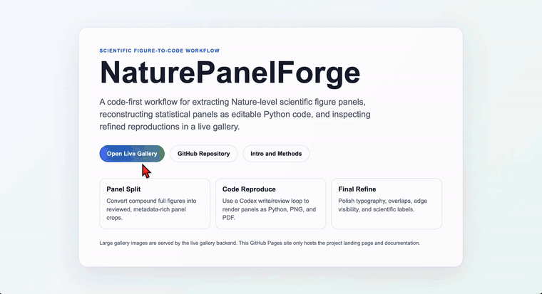
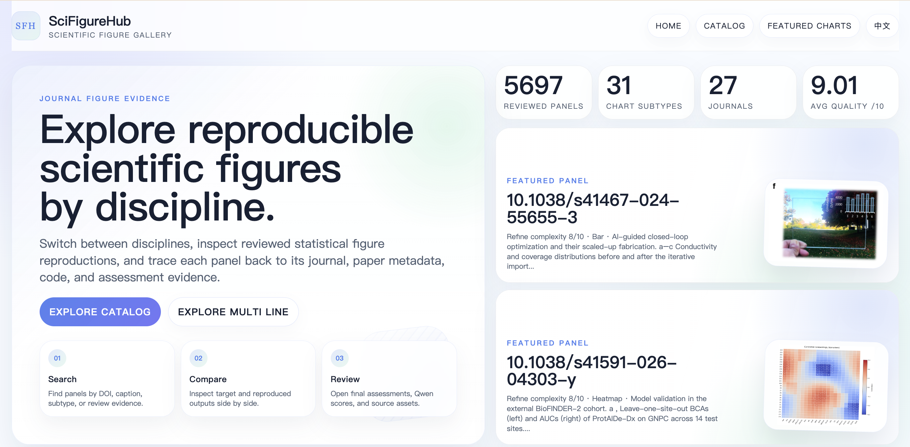
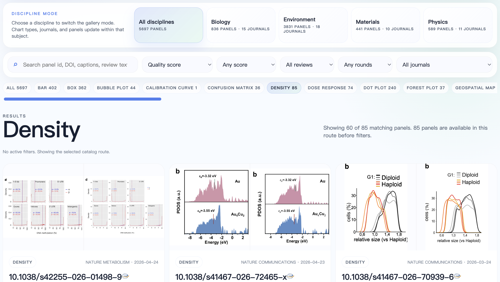
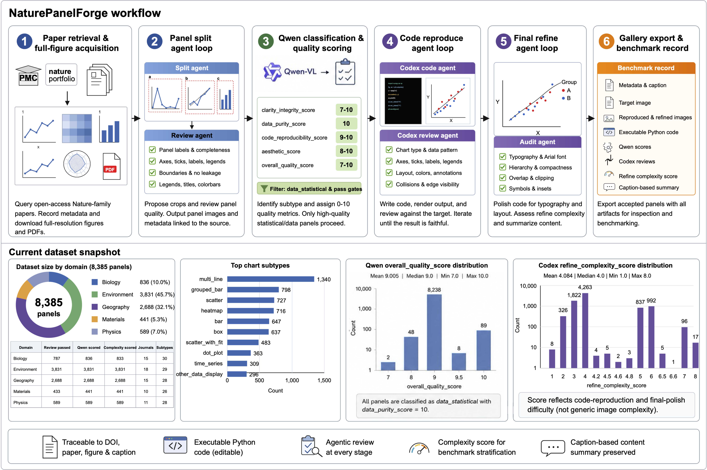
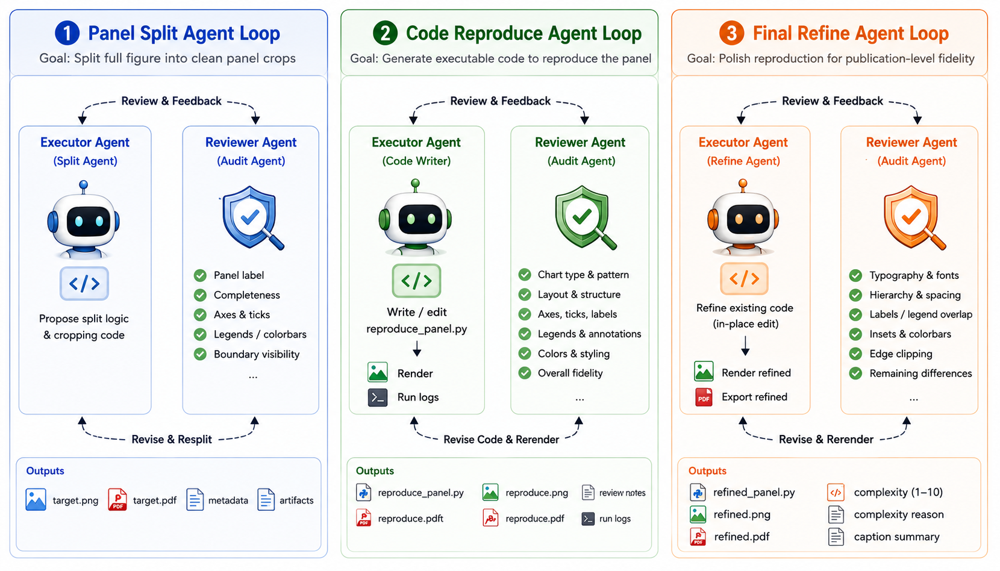
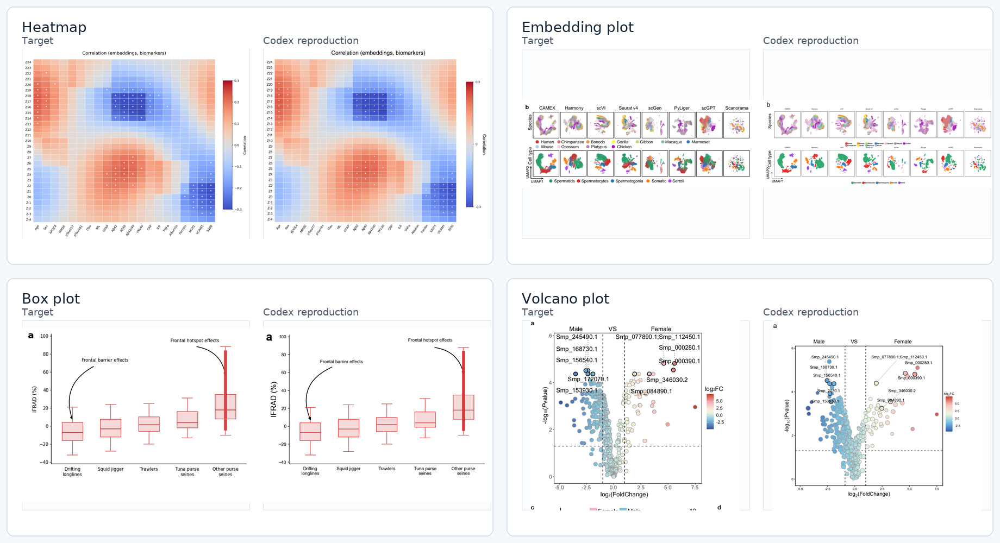

<h1 align="center">
  <br/>
  NaturePanelForge
</h1>

<p align="center">
  <b>Forge Nature-level scientific panels into executable plotting code.</b><br/>
  Retrieve open-access papers, split full figures into reviewed panels, classify them with Qwen, and reproduce statistical panels with Codex agent loops.
</p>

<p align="center">
  <a href="https://uu543493-83c1-74a94416.nma1.seetacloud.com:8448/"></a>
  <a href="#usage"></a>
  <a href="#agent-workflow"></a>
  <a href="docs/intro_and_methods.md"></a>
  <a href="#install-the-codex-skill"></a>
</p>

<p align="center">
  <a href="#usage">Usage</a> |
  <a href="#agent-workflow">Agent Workflow</a> |
  <a href="#codex-reproduction-examples">Examples</a> |
  <a href="#quick-start">Quick Start</a> |
  <a href="docs/intro_and_methods.md">Method</a> |
  <a href="TUTORIAL.md">Tutorial</a>
</p>

NaturePanelForge is a code-first workflow for turning scientific figure images and open-access Nature-family papers into panel-level, executable plotting-code reconstruction tasks. The repository does not depend on the hosted gallery demo.



[](docs/assets/show_compressed.mp4)





For the project introduction, methods, current dataset counts, Qwen score distributions, and Codex refine complexity distribution, see [Introduction and Methods](docs/intro_and_methods.md).

## Agent Workflow

NaturePanelForge uses three executable agent stages. Each stage writes machine-checkable artifacts and can be resumed.




**Panel Split** converts a compound full figure into complete panel crops. A split agent writes executable crop/spec logic, and a review agent checks panel letters, axis labels, ticks, legends, colorbars, titles, annotations, and edge visibility.

**Code Reproduce** turns a target panel into `reproduce_panel.py`, `reproduce_panel.png`, and `reproduce_panel.pdf`. A code-writing agent renders the plot, and a review agent compares the output against `target.png`; fixable issues trigger code edits and rerendering.

**Final Refine** starts from first-pass reproductions that already passed review. A polish agent edits the existing code, while an audit agent checks Arial typography, label/tick/legend overlap, scientific symbols, edge clipping, compactness, complexity score, and caption-based description.



This loop is the core mechanism for high-quality panel-to-code reproduction: each stage separates execution from review, records artifacts on disk, and iterates until the panel split, executable reproduction, or final refine result passes the corresponding audit.

## Codex Reproduction Examples

Target panels from real paper figures are shown beside Codex-rendered outputs. Each reproduction is generated from executable plotting code, not manual image editing.



## Usage

Use `forge.py` for the four public workflows. Each mode can be started with one command.

1. **Single cropped panel image -> plotting code**

```bash
python3 forge.py single-panel-image --image /path/to/target_panel.png --panel-id demo_panel --chart-type bar --caption "A grouped bar chart with error bars and a legend." --out-root UserRuns/panel_demo --model gpt-5.4 --reasoning-effort medium --review-rounds 4 --skip-existing
```

2. **Single full figure image -> reviewed panel crops**

```bash
python3 forge.py single-full-image --image /path/to/full_figure.png --paper-id demo_paper --caption "A complete multi-panel scientific figure." --out-root UserRuns/full_demo --model gpt-5.4 --reasoning-effort medium --review-rounds 4 --skip-existing
```

3. **Single paper -> paper metadata and full figures**

```bash
python3 forge.py single-paper --doi 10.1038/s41467-025-12345-6 --subject biology --topic AI_biology --figures-per-paper 5 --download-only
```

4. **Batched papers -> full paper-to-panel-to-code workflow**

```bash
python3 forge.py batched-paper --subject materials --topic AI_materials --target-papers 20 --batch-size 20 --figures-per-paper 5 --years 2024,2025,2026 --codex-model gpt-5.4 --codex-jobs 8
```

The repository root intentionally keeps only one Python entry point, `forge.py`. Internal pipeline modules live under `nature_panel_forge/`, while stage wrappers live under `scripts/`.

`single-panel-image` is the direct user-facing image-to-code path. A live run returns:

```text
target.png
metadata.json
qwen_score.json
reproduce_panel.py
reproduce_panel.png
reproduce_panel.pdf
user_reproduce_summary.json
result.json
```

`user_reproduce_summary.json` and `result.json` include the generated code text, output paths, review status, missing-output checks, and whether the live contract passed. Dry-runs intentionally set `live_contract_checked=false` and `contract_passed=false`.

## Quick Start

```bash
cd NaturePanelForge
python3 -m venv .venv
source .venv/bin/activate
pip install -r requirements.txt
cp configs/demo.env.example .env
source .env
```

Required external pieces:

- network access for paper and figure download
- Codex CLI for panel splitting, reproduction, and refine
- local Qwen vision model for panel classification/scoring

Check Codex:

```bash
codex --version
```

Set Qwen:

```bash
export QWEN_MODEL_PATH=/path/to/Qwen3.6-27B
export CUDA_VISIBLE_DEVICES=0
```

The default Qwen path is local `transformers` loading through `--qwen-backend transformers`. `--qwen-backend openai` is only an optional compatibility hook for users who intentionally run an OpenAI-compatible vision endpoint.

## Install The Codex Skill

Yes, the Codex reproduce/refine workflow can be packaged as a local skill. This repository includes:

```text
skills/codex-panel-reproduce/SKILL.md
```

Install all bundled skills into local Codex:

```bash
bash scripts/install_skills.sh
```

Dry-run the installer:

```bash
DRY_RUN=1 bash scripts/install_skills.sh
```

The live installer replaces destination skill directories with the same names under `${CODEX_HOME:-$HOME/.codex}/skills`. Run the dry-run first if you already keep custom local skills there.

You can also paste this into a local Codex session and let it install the skill for you:

```text
Please install the NaturePanelForge bundled Codex skill on this machine.

Steps:
1. Confirm that the current working directory is the NaturePanelForge repository root. If it is not, ask me for the repository path before running commands.

2. Run a dry-run first:
   DRY_RUN=1 bash scripts/install_skills.sh

3. If the dry-run succeeds and shows that codex-panel-reproduce will be installed into ${CODEX_HOME:-$HOME/.codex}/skills, run the live install:
   bash scripts/install_skills.sh

4. Check that this file exists:
   ${CODEX_HOME:-$HOME/.codex}/skills/codex-panel-reproduce/SKILL.md

5. Do not modify other project files. Report the install path, dry-run summary, and whether the live install succeeded.
```

After installation, local Codex can read the `codex-panel-reproduce` skill and follow the single-panel reproduction/refine workflow without re-learning the prompt structure from scratch.

## Repository Layout

```text
forge.py                            # single public Python CLI entry point
nature_panel_forge/                 # internal paper, figure, export, refine, and image-to-code modules
agent_loop/                         # Codex panel splitting, manifest building, Qwen scoring
examples/                           # Codex reproduction and final-refine batch drivers
scripts/                            # portable stage wrappers and skill installer
gallery/                            # static gallery shell and catalog builder
skills/                             # local Codex skill packages
configs/                            # environment templates
docs/                               # architecture, methods, and visual assets
prompts/                            # agent prompt blueprints
```

Generated run directories look like:

```text
PipelineRuns/<subject>/<topic>/run_YYYYMMDD_HHMMSS_batch001/
  Papers/
  FullFigures/full_figures.csv
  Panels_codex_full/
  PanelReviews_codex_full/
  QwenPanelScore/
  Final_Schematic/
  Reproduce_Statistical/
  Reproduce_Statistical_Reviews/
  Reproduce_Statistical_Refined/
```

## More Documentation

- [Tutorial](TUTORIAL.md)
- [Architecture](docs/architecture.md)
- [Introduction and Methods](docs/intro_and_methods.md)

## Citation

If you use this workflow in a paper or benchmark, cite the project repository and describe the exact paper sources, model versions, scoring thresholds, and Codex review-round settings used in your run.
