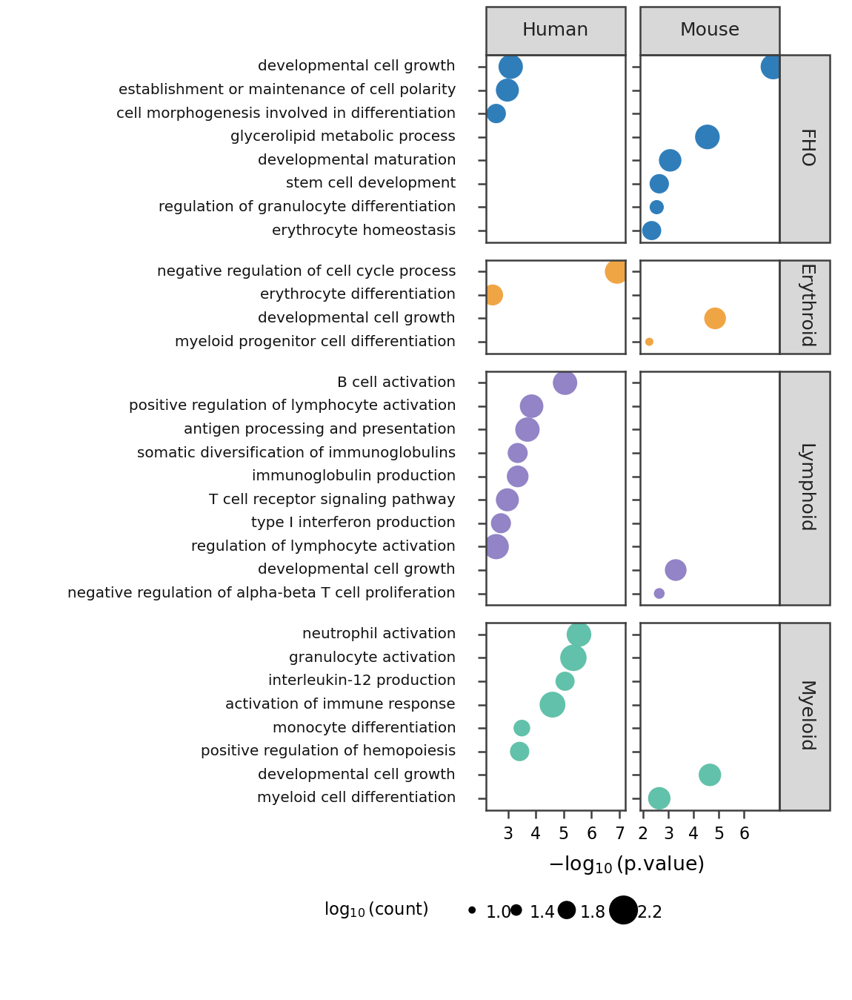

<h1 align="center">
  <br/>
  NaturePanelForge
</h1>

<p align="center">
  <b>Forge Nature-level scientific panels into executable plotting code.</b><br/>
  Retrieve open-access papers, split full figures into reviewed panels, classify them with Qwen, and reproduce statistical panels with Codex agent loops.
</p>

<p align="center">
  <a href="https://littlepeachs.github.io/NaturePanelForge/"></a>
  <a href="https://uu543493-83c1-74a94416.nma1.seetacloud.com:8448/"></a>
  <a href="#usage"></a>
  <a href="#agent-workflow"></a>
  <a href="docs/intro_and_methods.md"></a>
  <a href="#install-the-codex-skill"></a>
</p>

<p align="center">
  
</p>

<p align="center">
  <a href="#usage">Usage</a> |
  <a href="#quick-start-demo">Quick Start Demo</a> |
  <a href="#agent-workflow">Agent Workflow</a> |
  <a href="#zero-shot-benchmark">Zero-Shot Benchmark</a> |
  <a href="#codex-reproduction-examples">Examples</a> |
  <a href="#setup">Setup</a> |
  <a href="docs/intro_and_methods.md">Method</a> |
  <a href="TUTORIAL.md">Tutorial</a>
</p>

<p align="center">
  <b>English</b> | <a href="README.zh-CN.md">中文</a>
</p>

NaturePanelForge is a code-first workflow for turning scientific figure images and open-access Nature-family papers into panel-level, executable plotting-code reconstruction tasks. The repository does not depend on the hosted gallery demo.


[](docs/assets/show_compressed.mp4)


For the project introduction, methods, current dataset counts, Qwen score distributions, and Codex refine complexity distribution, see [Introduction and Methods](docs/intro_and_methods.md).

## Quick Start Demo

The quick start has two simple paths:

### **Mode 1. Direct Code Mode**

**Run the checked-in plotting code directly.** This is the fastest path: no Codex loop and no skill installation.

<table>
<tr>
<td width="50%" align="center"><b>Direct Code Mode Target</b></td>
<td width="50%" align="center"><b>Direct Code Mode Reproduction</b></td>
</tr>
<tr>
<td></td>
<td></td>
</tr>
</table>

One command:

```bash
bash scripts/run_quick_start_demo.sh
```

It rerenders the checked-in script and images:

```text
docs/demo/quick_start_bubble_plot/reproduce_panel.py
docs/demo/quick_start_bubble_plot/reproduce_panel.png
docs/demo/quick_start_bubble_plot/reproduce_panel.pdf
```

### **Mode 2. Install Codex Skill Mode**

**Install the bundled Code Skill, then paste the full System Prompt inside Codex.** Codex uses `codex-panel-reproduce` to read the target image, write editable Python/matplotlib code, render the reproduction image/PDF, and save review files.

<table>
<tr>
<td width="50%" align="center"><b>Codex Skill Mode Target</b></td>
<td width="50%" align="center"><b>Codex Skill Mode Reproduction</b></td>
</tr>
<tr>
<td></td>
<td></td>
</tr>
</table>

**Install Skill Prompt:**

```text
Install the NaturePanelForge Codex skill for me: https://github.com/littlepeachs/NaturePanelForge
```

Codex will read the repository, install the bundled `codex-panel-reproduce` skill, and verify that it is available locally.

**English System Prompt:**

```text
Please use the installed codex-panel-reproduce skill to reproduce this scientific paper panel as editable Python/matplotlib code.

Target image: docs/demo/quick_start_skill_bubble_plot/target.png
Optional PDF: docs/demo/quick_start_skill_bubble_plot/target.pdf
Output root: UserRuns/my_skill_test
Panel id: my_skill_test
Chart type: bubble_plot
Caption: A faceted GO enrichment bubble plot with Human and Mouse columns, biological process labels on the left, x axis as -log10(p.value), bubble size encoding log10(count), and colors encoding biological groups.

Requirements:
1. Use the codex-panel-reproduce skill.
2. Do not use Qwen scoring; this is a local user-supplied image.
3. Do not manually modify images; generate executable plotting code only.
4. Run the NaturePanelForge single-panel reproduction workflow.
5. Generate reproduce_panel.py, reproduce_panel.png, and reproduce_panel.pdf.
6. Generate review notes, review summary, and run log.
7. Finally report the output directory, review_passed, contract_passed, final PNG size, and rerender command.
```

**中文 System Prompt：**

```text
请使用已安装的 codex-panel-reproduce skill，帮我复现这个科学论文 panel 图像为可编辑的 Python/matplotlib 代码。

目标图像：docs/demo/quick_start_skill_bubble_plot/target.png
可选 PDF：docs/demo/quick_start_skill_bubble_plot/target.pdf
输出根目录：UserRuns/my_skill_test
panel id：my_skill_test
图类型：bubble_plot
caption：A faceted GO enrichment bubble plot with Human and Mouse columns, biological process labels on the left, x axis as -log10(p.value), bubble size encoding log10(count), and colors encoding biological groups.

要求：
1. 使用 codex-panel-reproduce skill。
2. 不要使用 Qwen scoring，这是本地用户提供的图片。
3. 不要手工修改图片，只生成可执行绘图代码。
4. 运行 NaturePanelForge 的单图复现 workflow。
5. 生成 reproduce_panel.py、reproduce_panel.png、reproduce_panel.pdf。
6. 生成 review notes、review summary、run log。
7. 最后告诉我输出目录、review_passed、contract_passed、最终 PNG 尺寸和重新渲染命令。
```

The target image is the input, and the reproduction image is the expected editable-code output. For the full prompts saved as files, see [English prompt](docs/demo/quick_start_skill_bubble_plot/prompt.en.md) and [中文 prompt](docs/demo/quick_start_skill_bubble_plot/prompt.zh-CN.md).

Offline rerender for the checked-in Skill Mode result:

```bash
DEMO_CASE=quick_start_skill_bubble_plot bash scripts/run_quick_start_demo.sh
```

To use your own data in the same visual style, edit the data arrays and labels in one of the demo `reproduce_panel.py` scripts, then rerun it. If your goal is specifically “take a reference plot style and redraw my new data in that style,” FigMirror is the more product-like path; NaturePanelForge focuses on building scientific panel-to-code benchmark examples from real papers.

## Agent Workflow

NaturePanelForge uses three executable agent stages. Each stage writes machine-checkable artifacts and can be resumed.


**Panel Split** converts a compound full figure into complete panel crops. A split agent writes executable crop/spec logic, and a review agent checks panel letters, axis labels, ticks, legends, colorbars, titles, annotations, and edge visibility.

**Code Reproduce** turns a target panel into `reproduce_panel.py`, `reproduce_panel.png`, and `reproduce_panel.pdf`. A code-writing agent renders the plot, and a review agent compares the output against `target.png`; fixable issues trigger code edits and rerendering.

**Final Refine** starts from first-pass reproductions that already passed review. A polish agent edits the existing code, while an audit agent checks Arial typography, label/tick/legend overlap, scientific symbols, edge clipping, compactness, complexity score, and caption-based description.


This loop is the core mechanism for high-quality panel-to-code reproduction: each stage separates execution from review, records artifacts on disk, and iterates until the panel split, executable reproduction, or final refine result passes the corresponding audit.

## Dataset Refinement

NaturePanelForge uses a refined paper-to-panel-to-code workflow to build benchmark-ready scientific chart samples:

```text
open-access paper figures -> reviewed panel crops -> Qwen panel scoring ->
Codex code reproduction -> Final Refine -> clean-sample audit -> benchmark manifests
```

The current SciFigure2Code release manifest contains 6,740 clean benchmark candidates from an 8,385-panel formal gallery. Clean samples include the original target PNG/PDF, refined reproduced PNG/PDF, editable `reproduce_panel.py`, description metadata, chart subtype, scientific domain, and complexity label.

The GitHub repository keeps only the small smoke manifest under:

```text
SciFigure2Code/benchmark_ready/
```

Use subsets by cost:

| Manifest | Use |
|---|---|
| `clean_tiny100.json` | checked-in quick smoke / pilot |
| `clean_mini500.json` | download from the Hugging Face dataset release |
| `clean_dev1000.json` | download from the Hugging Face dataset release |
| `clean_samples.json` | download from the Hugging Face dataset release |

For the full refinement procedure and audit criteria, see [Dataset Refinement Workflow](docs/dataset_refinement.md).

## Zero-Shot Benchmark

The repository includes the zero-shot SciFigure2Code evaluator and wrappers for the fixed 11-model benchmark. The evaluator generates plotting code from a target panel image, executes the code, saves candidate PNG/PDF artifacts, and reports P0/P1/P2 metrics.

Prepare the environment:

```bash
cd NaturePanelForge
python3 -m venv .venv
source .venv/bin/activate
pip install -r requirements.txt
source configs/zeroshot.env.example
```

Download the SciPanelForge dataset from Hugging Face:

```bash
export HF_TOKEN="${HF_TOKEN:-}"  # optional for public files; required for private/gated access
python - <<'PY'
import os
from huggingface_hub import snapshot_download

snapshot_download(
    repo_id="littlepeachs/SciPanelForge",
    repo_type="dataset",
    local_dir=".data/SciPanelForge",
    token=os.environ.get("HF_TOKEN") or None,
)
PY
```

If you need the Hugging Face mirror endpoint, set `HF_ENDPOINT` before running the same code:

```bash
export HF_ENDPOINT=https://hf-mirror.com
export HF_TOKEN="${HF_TOKEN:-}"
python - <<'PY'
import os
from huggingface_hub import snapshot_download

snapshot_download(
    repo_id="littlepeachs/SciPanelForge",
    repo_type="dataset",
    local_dir=".data/SciPanelForge",
    token=os.environ.get("HF_TOKEN") or None,
    endpoint="https://hf-mirror.com",
)
PY
```

The helper script wraps the same `snapshot_download` call and prints the detected manifests:

```bash
bash scripts/download_benchmark_dataset.sh
export SCIFIGURE_DATASET="${PWD}/.data/SciPanelForge/clean_tiny100.json"
```

Download ChartIDE-8B:

```bash
export HF_TOKEN="${HF_TOKEN:-}"
export VLM_ROOT="${PWD}/.models"
export VLM_MODEL_ROOT="${VLM_ROOT}/models"
python - <<'PY'
import os
from huggingface_hub import snapshot_download

snapshot_download(
    repo_id="Fengx1nn/CharTide-8B",
    repo_type="model",
    local_dir=".models/models/Fengx1nn/CharTide-8B",
    token=os.environ.get("HF_TOKEN") or None,
)
PY
```

Mirror endpoint version:

```bash
export HF_ENDPOINT=https://hf-mirror.com
export HF_TOKEN="${HF_TOKEN:-}"
python - <<'PY'
import os
from huggingface_hub import snapshot_download

snapshot_download(
    repo_id="Fengx1nn/CharTide-8B",
    repo_type="model",
    local_dir=".models/models/Fengx1nn/CharTide-8B",
    token=os.environ.get("HF_TOKEN") or None,
    endpoint="https://hf-mirror.com",
)
PY
```

Or use the model helper:

```bash
bash scripts/download_zeroshot_models.sh chartide_8b
```

List or download the fixed 11-model roster:

```bash
bash scripts/download_zeroshot_models.sh --list
bash scripts/download_zeroshot_models.sh chartide_8b
# Or download all 11 model repositories:
bash scripts/download_zeroshot_models.sh
```

Run one model on `clean_tiny100`. This is the recommended single-model entry
point for checking a new setup:

```bash
export SCIFIGURE_DATASET="${PWD}/SciFigure2Code/benchmark_ready/clean_tiny100.json"
export TRANSFORMERS_OFFLINE=1
export HF_HUB_OFFLINE=1
bash scripts/run_zeroshot_model.sh chartide_8b 0 100 "${SCIFIGURE_DATASET}"
```

Equivalent direct Python entry:

```bash
CUDA_VISIBLE_DEVICES=0 python -m SciFigure2Code.evaluation \
  --dataset "${SCIFIGURE_DATASET}" \
  --model-id chartide_8b \
  --benchmark-mode zeroshot \
  --prompt-style short \
  --limit 100 \
  --max-new-tokens 2048 \
  --gpus 0 \
  --resume \
  --output-dir BenchmarkRuns/chartide_8b_zeroshot_100
```

Run all 11 models:

```bash
export GPU_IDS=0
export LIMIT=100
bash scripts/run_zeroshot_11models.sh
```

For multi-GPU launch:

```bash
export GPU_IDS=0,1,2,3
export RUN_PARALLEL=1
bash scripts/run_zeroshot_11models.sh
```

Current `clean_tiny100` zero-shot smoke result:

| Group | Model | Valid | Visual | Type | Layout | Data | Text | Axis | Clarity | Avg. Score |
|---|---|---:|---:|---:|---:|---:|---:|---:|---:|---:|
| General VLM | Intern-S2-Preview | 84.00 | 47.51 | 64.24 | 45.83 | 47.51 | 47.51 | 47.38 | 42.76 | 51.99 |
| General VLM | GLM-4.5V | 81.00 | 44.68 | 63.73 | 43.23 | 44.68 | 44.68 | 44.70 | 40.21 | 49.48 |
| General VLM | LLaVA-OneVision-72B | 79.00 | 41.43 | 55.24 | 40.43 | 41.43 | 41.43 | 41.01 | 37.29 | 45.87 |
| General VLM | Ovis2-6-80B-A3B | 71.00 | 38.85 | 53.96 | 37.51 | 38.85 | 38.85 | 39.06 | 34.96 | 42.96 |
| General VLM | Phi-4-Reasoning-Vision-15B | 71.00 | 37.47 | 50.76 | 36.80 | 37.47 | 37.47 | 37.89 | 33.72 | 41.73 |
| General VLM | Molmo-72B | 68.00 | 33.90 | 47.95 | 33.29 | 33.90 | 33.90 | 34.55 | 30.51 | 38.38 |
| General VLM | Qwen3.5-122B-A10B | 66.00 | 38.06 | 50.68 | 37.23 | 38.06 | 38.06 | 38.06 | 34.26 | 41.57 |
| General VLM | Gemma-4-31B-IT | 58.00 | 35.38 | 45.15 | 33.81 | 35.38 | 35.38 | 35.16 | 31.84 | 37.91 |
| General VLM | Pixtral-12B | 32.00 | 16.69 | 22.25 | 16.19 | 16.69 | 16.69 | 16.60 | 15.02 | 18.49 |
| Finetuned ChartVLM | ChartCoder | 54.00 | 28.64 | 40.75 | 27.65 | 28.64 | 28.64 | 28.80 | 25.77 | 31.93 |
| Finetuned ChartVLM | ChartIDE-8B | 82.00 | 48.30 | 62.22 | 46.63 | 48.30 | 48.30 | 48.38 | 43.47 | 52.26 |

`Avg. Score` is the mean of available P0 core metrics after execution gating. Full instructions, model paths, metric definitions, dry-run commands, and summary commands are in [Zero-Shot SciFigure2Code Benchmark](docs/zeroshot_benchmark.md). The CSV copy is [zeroshot_11models_clean_tiny100.csv](docs/assets/benchmark/zeroshot_11models_clean_tiny100.csv).

## Codex Reproduction Examples

Target panels from real paper figures are shown beside Codex-rendered outputs. Each reproduction is generated from executable plotting code, not manual image editing.


## Usage

Use `forge.py` for the four public workflows. Each mode can be started with one command.

1. **Single cropped panel image -> plotting code**

```bash
python3 forge.py single-panel-image --image /path/to/target_panel.png --panel-id demo_panel --chart-type bar --caption "A grouped bar chart with error bars and a legend." --out-root UserRuns/panel_demo --model gpt-5.4 --reasoning-effort medium --review-rounds 4 --skip-existing
```

2. **Single full figure image -> reviewed panel crops**

```bash
python3 forge.py single-full-image --image /path/to/full_figure.png --paper-id demo_paper --caption "A complete multi-panel scientific figure." --out-root UserRuns/full_demo --model gpt-5.4 --reasoning-effort medium --review-rounds 4 --skip-existing
```

3. **Single paper -> paper metadata and full figures**

```bash
python3 forge.py single-paper --doi 10.1038/s41467-025-12345-6 --subject biology --topic AI_biology --figures-per-paper 5 --download-only
```

4. **Batched papers -> full paper-to-panel-to-code workflow**

```bash
python3 forge.py batched-paper --subject materials --topic AI_materials --target-papers 20 --batch-size 20 --figures-per-paper 5 --years 2024,2025,2026 --codex-model gpt-5.4 --codex-jobs 8
```

The repository root intentionally keeps only one Python entry point, `forge.py`. Internal pipeline modules live under `nature_panel_forge/`, while stage wrappers live under `scripts/`.

`single-panel-image` is the direct user-facing image-to-code path. A live run returns:

```text
target.png
metadata.json
qwen_score.json
reproduce_panel.py
reproduce_panel.png
reproduce_panel.pdf
user_reproduce_summary.json
result.json
```

`user_reproduce_summary.json` and `result.json` include the generated code text, output paths, review status, missing-output checks, and whether the live contract passed. Dry-runs intentionally set `live_contract_checked=false` and `contract_passed=false`.

## Setup

```bash
cd NaturePanelForge
python3 -m venv .venv
source .venv/bin/activate
pip install -r requirements.txt
cp configs/demo.env.example .env
source .env
```

Required external pieces:

- network access for paper and figure download
- Codex CLI for panel splitting, reproduction, and refine
- local Qwen vision model for panel classification/scoring

Check Codex:

```bash
codex --version
```

Set Qwen:

```bash
export QWEN_MODEL_PATH=/path/to/Qwen3.6-27B
export CUDA_VISIBLE_DEVICES=0
```

The default Qwen path is local `transformers` loading through `--qwen-backend transformers`. `--qwen-backend openai` is only an optional compatibility hook for users who intentionally run an OpenAI-compatible vision endpoint.

## Install The Codex Skill

The easiest way is to let Codex install it from this GitHub repository. Already inside Codex? Paste this prompt:

**Install Skill Prompt:**

```text
Install the NaturePanelForge Codex skill for me: https://github.com/littlepeachs/NaturePanelForge
```

Codex should clone or open the repository, install `skills/codex-panel-reproduce/SKILL.md` into the local Codex skills directory, and verify that this file exists:

```text
${CODEX_HOME:-$HOME/.codex}/skills/codex-panel-reproduce/SKILL.md
```

After installation, use the full English or Chinese System Prompt shown in Quick Start Mode 2.

Local Codex can then follow the single-panel reproduction/refine workflow without re-learning the prompt structure from scratch.

## Repository Layout

```text
forge.py                            # single public Python CLI entry point
nature_panel_forge/                 # internal paper, figure, export, refine, and image-to-code modules
agent_loop/                         # Codex panel splitting, manifest building, Qwen scoring
SciFigure2Code/evaluation/          # zero-shot chart-to-code evaluator and P0/P1/P2 metrics
SciFigure2Code/benchmark_ready/     # clean benchmark manifests and release statistics
examples/                           # Codex reproduction and final-refine batch drivers
scripts/                            # portable stage wrappers and skill installer
gallery/                            # static gallery shell and catalog builder
skills/                             # local Codex skill packages
configs/                            # environment templates
docs/                               # architecture, methods, and visual assets
prompts/                            # agent prompt blueprints
```

Generated run directories look like:

```text
PipelineRuns/<subject>/<topic>/run_YYYYMMDD_HHMMSS_batch001/
  Papers/
  FullFigures/full_figures.csv
  Panels_codex_full/
  PanelReviews_codex_full/
  QwenPanelScore/
  Final_Schematic/
  Reproduce_Statistical/
  Reproduce_Statistical_Reviews/
  Reproduce_Statistical_Refined/
```

## More Documentation

- [Tutorial](TUTORIAL.md)
- [Architecture](docs/architecture.md)
- [Introduction and Methods](docs/intro_and_methods.md)
- [Dataset Refinement Workflow](docs/dataset_refinement.md)
- [Zero-Shot SciFigure2Code Benchmark](docs/zeroshot_benchmark.md)

## Citation

If you use this workflow in a paper or benchmark, cite the project repository and describe the exact paper sources, model versions, scoring thresholds, and Codex review-round settings used in your run.
