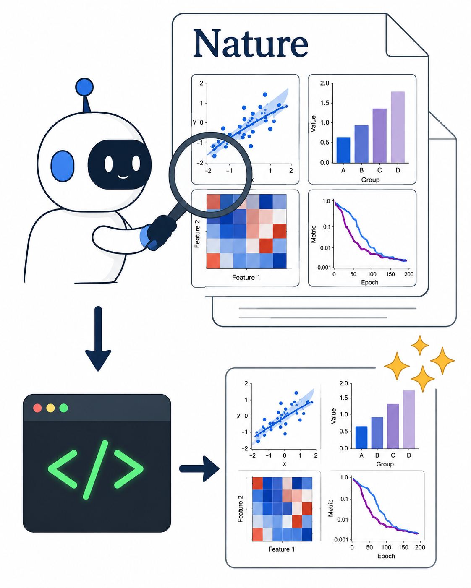
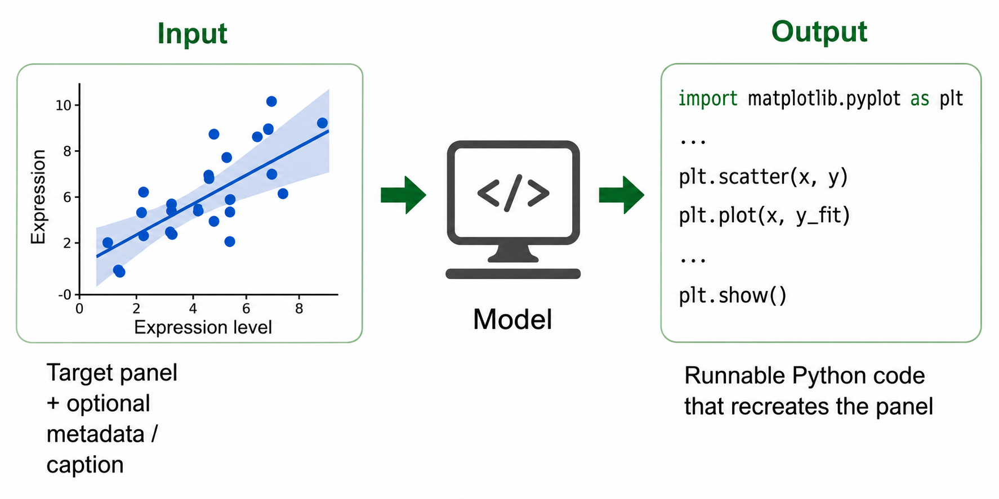
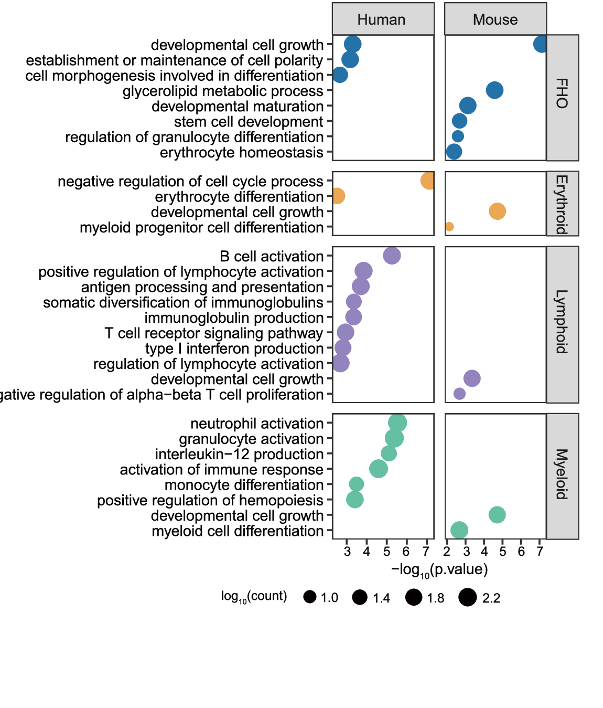
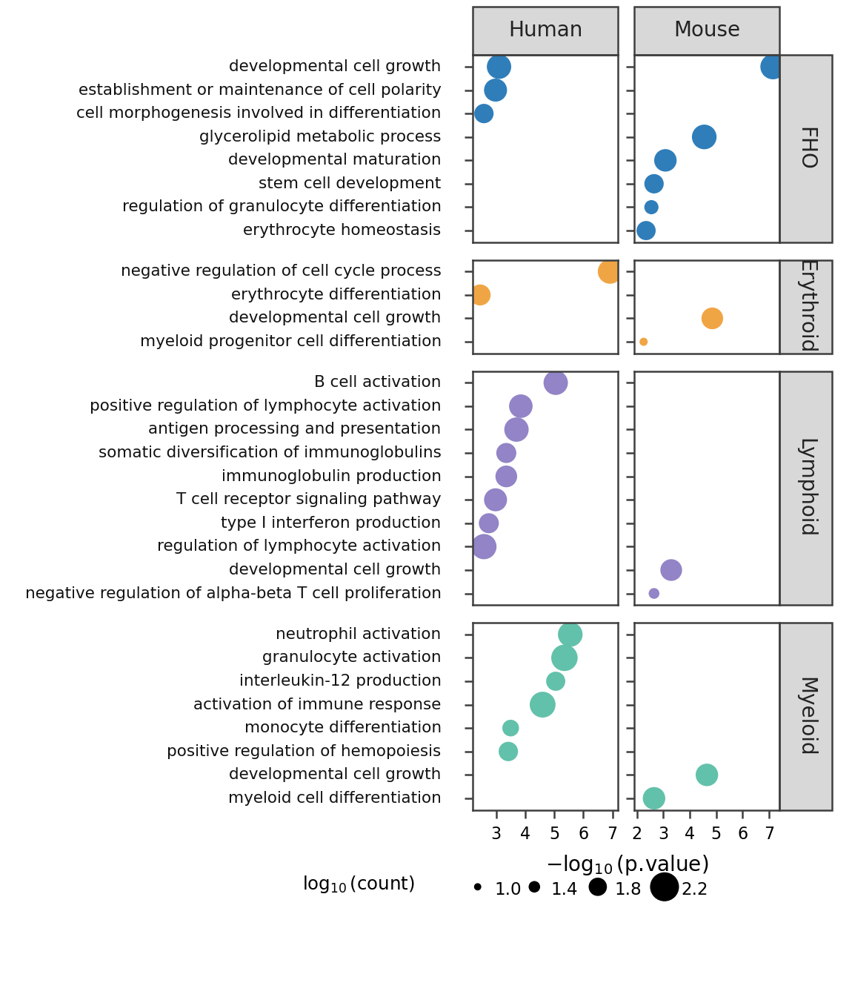

<h1 align="center">
  <br/>
  NaturePanelForge
</h1>

<p align="center">
  <b>把 Nature 级别科学论文图转化为可执行绘图代码。</b><br/>
  自动检索开放获取论文，下载全文图，切分 panel，调用 Qwen 进行图像类型与质量评分，并通过 Codex agent loop 复现统计图代码。
</p>

<p align="center">
  <a href="https://uu543493-83c1-74a94416.nma1.seetacloud.com:8448/"></a>
  <a href="#使用方式"></a>
  <a href="#agent-workflow"></a>
  <a href="docs/intro_and_methods.md"></a>
  <a href="#安装-codex-skill"></a>
</p>

<p align="center">
  
</p>

<p align="center">
  <a href="#使用方式">使用方式</a> |
  <a href="#快速上手">快速上手</a> |
  <a href="#agent-workflow">Agent Workflow</a> |
  <a href="#codex-复现示例">复现示例</a> |
  <a href="#环境配置">环境配置</a> |
  <a href="docs/intro_and_methods.md">方法与统计</a> |
  <a href="TUTORIAL.md">教程</a>
</p>

<p align="center">
  <a href="README.md">English</a> | <b>中文</b>
</p>

NaturePanelForge 是一个 code-first 工作流，用于把真实科学论文图像和开放获取 Nature 系列论文转化为 panel 级别、可执行绘图代码复现任务。本仓库代码不依赖线上 gallery demo。


[](docs/assets/show_compressed.mp4)


项目介绍、方法、当前数据量、Qwen 分数分布和 Codex refine 复杂度分布见 [Introduction and Methods](docs/intro_and_methods.md)。

## 快速上手

快速上手保持很小：从一张裁剪好的科学论文 panel 出发，用可编辑的 `matplotlib` 代码重新渲染图片，并且可以选择重新跑完整 Codex review loop。仓库内置两个 demo case：

- `docs/demo/quick_start_bubble_plot/`：默认 bubble plot 离线重渲染示例。
- `docs/demo/quick_start_skill_bubble_plot/`：本次 `codex-panel-reproduce` skill 运行案例，包含 target/reproduction 图片和中英文 prompt。

<table>
<tr>
<td width="50%" align="center"><b>目标 panel</b></td>
<td width="50%" align="center"><b>可执行 Python 复现结果</b></td>
</tr>
<tr>
<td></td>
<td></td>
</tr>
</table>

本地跑默认 demo：

```bash
bash scripts/run_quick_start_demo.sh
```

本地跑本次 skill 示例：

```bash
DEMO_CASE=quick_start_skill_bubble_plot bash scripts/run_quick_start_demo.sh
```

离线重渲染会运行已提交的可编辑脚本，并在 demo 文件夹内写出 PNG/PDF：

```text
docs/demo/<demo_case>/reproduce_panel.py
docs/demo/<demo_case>/reproduce_panel.png
docs/demo/<demo_case>/reproduce_panel.pdf
```

如果要从目标 panel 图像重新走完整 Codex agent loop：

```bash
RUN_CODEX=1 DEMO_CASE=quick_start_skill_bubble_plot OUT_ROOT=UserRuns/my_skill_test_from_docs bash scripts/run_quick_start_demo.sh
```

完整运行会在 `UserRuns/` 下写出目标 bundle、代码输出、review notes、review summary、run log 和 contract result。本次 skill 示例的可复制 prompt 文件在：

- [English prompt](docs/demo/quick_start_skill_bubble_plot/prompt.en.md)
- [中文 prompt](docs/demo/quick_start_skill_bubble_plot/prompt.zh-CN.md)

<details>
<summary>中文 Prompt</summary>

```text
请使用已安装的 codex-panel-reproduce skill，帮我复现这个科学论文 panel 图像为可编辑的 Python/matplotlib 代码。

目标图像：docs/demo/quick_start_skill_bubble_plot/target.png
可选 PDF：docs/demo/quick_start_skill_bubble_plot/target.pdf
输出根目录：UserRuns/my_skill_test
panel id：my_skill_test
图类型：bubble_plot
caption：A faceted GO enrichment bubble plot with Human and Mouse columns, biological process labels on the left, x axis as -log10(p.value), bubble size encoding log10(count), and colors encoding biological groups.

要求：
1. 使用 codex-panel-reproduce skill。
2. 不要使用 Qwen scoring，这是本地用户提供的图片。
3. 不要手工修改图片，只生成可执行绘图代码。
4. 运行 NaturePanelForge 的单图复现 workflow。
5. 生成 reproduce_panel.py、reproduce_panel.png、reproduce_panel.pdf。
6. 生成 review notes、review summary、run log。
7. 最后告诉我输出目录、review_passed、contract_passed、最终 PNG 尺寸和重新渲染命令。
```

</details>

<details>
<summary>English prompt</summary>

```text
Please use the installed codex-panel-reproduce skill to reproduce this scientific paper panel as editable Python/matplotlib code.

Target image: docs/demo/quick_start_skill_bubble_plot/target.png
Optional PDF: docs/demo/quick_start_skill_bubble_plot/target.pdf
Output root: UserRuns/my_skill_test
Panel id: my_skill_test
Chart type: bubble_plot
Caption: A faceted GO enrichment bubble plot with Human and Mouse columns, biological process labels on the left, x axis as -log10(p.value), bubble size encoding log10(count), and colors encoding biological groups.

Requirements:
1. Use the codex-panel-reproduce skill.
2. Do not use Qwen scoring; this is a local user-supplied image.
3. Do not manually modify images; generate executable plotting code only.
4. Run the NaturePanelForge single-panel reproduction workflow.
5. Generate reproduce_panel.py, reproduce_panel.png, and reproduce_panel.pdf.
6. Generate review notes, review summary, and run log.
7. Finally report the output directory, review_passed, contract_passed, final PNG size, and rerender command.
```

</details>

如果你想把自己的数据画成同样风格，可以直接修改 `docs/demo/quick_start_skill_bubble_plot/reproduce_panel.py` 里的数据数组和标签，然后重新运行脚本。如果目标是“拿一张参考论文图，把自己的新数据画成类似风格”，FigMirror 更像面向普通研究者的产品；NaturePanelForge 的重点是从真实论文图构建 scientific panel-to-code benchmark。

## Agent Workflow

NaturePanelForge 使用三个可恢复的 agent 阶段。每个阶段都会把中间产物、审核结果和最终文件落盘。


**Panel Split** 将完整复合图切分为干净 panel crop。执行 agent 生成切图逻辑和 crop/spec 文件，review agent 检查 panel 字母、坐标轴标签、tick、legend、colorbar、标题、annotation 和边界可见性。

**Code Reproduce** 将目标 panel 转化为 `reproduce_panel.py`、`reproduce_panel.png` 和 `reproduce_panel.pdf`。代码 agent 负责绘图，review agent 对比 `target.png` 与复现图；如果发现可修复问题，就继续修改代码并重新渲染。

**Final Refine** 从已经通过首轮 review 的复现结果出发，进一步精修。refine agent 在原有代码上编辑，audit agent 检查 Arial 字体、label/tick/legend 重叠、科学符号、边缘截断、布局紧凑度、复杂度评分和 caption 摘要。


这个 agent loop 是高质量 panel-to-code 复现的核心机制：每个阶段都把“执行”和“审核”拆开，通过多轮反馈迭代，直到 panel 划分、代码复现或最终精修通过对应审核。

## Codex 复现示例

下图展示真实论文目标 panel 与 Codex 渲染结果的并排对比。所有复现结果都来自可执行绘图代码，不是手工图片修补。


## 使用方式

统一入口是 `forge.py`。四种公开使用模式都可以一行命令启动。

1. **单个裁剪 panel 图像 -> 绘图代码**

```bash
python3 forge.py single-panel-image --image /path/to/target_panel.png --panel-id demo_panel --chart-type bar --caption "A grouped bar chart with error bars and a legend." --out-root UserRuns/panel_demo --model gpt-5.4 --reasoning-effort medium --review-rounds 4 --skip-existing
```

2. **单张完整复合图 -> reviewed panel crops**

```bash
python3 forge.py single-full-image --image /path/to/full_figure.png --paper-id demo_paper --caption "A complete multi-panel scientific figure." --out-root UserRuns/full_demo --model gpt-5.4 --reasoning-effort medium --review-rounds 4 --skip-existing
```

3. **单篇论文 -> 论文元数据与 full figures**

```bash
python3 forge.py single-paper --doi 10.1038/s41467-025-12345-6 --subject biology --topic AI_biology --figures-per-paper 5 --download-only
```

4. **批量论文 -> 完整 paper-to-panel-to-code 流程**

```bash
python3 forge.py batched-paper --subject materials --topic AI_materials --target-papers 20 --batch-size 20 --figures-per-paper 5 --years 2024,2025,2026 --codex-model gpt-5.4 --codex-jobs 8
```

仓库根目录只保留一个公开 Python 入口 `forge.py`。内部 pipeline 模块位于 `nature_panel_forge/`，阶段封装脚本位于 `scripts/`。

`single-panel-image` 是最直接的用户端 image-to-code 路径。一次真实运行会返回：

```text
target.png
metadata.json
qwen_score.json
reproduce_panel.py
reproduce_panel.png
reproduce_panel.pdf
user_reproduce_summary.json
result.json
```

`user_reproduce_summary.json` 和 `result.json` 会记录生成代码、输出路径、review 状态、缺失文件检查，以及 live contract 是否通过。dry-run 会显式设置 `live_contract_checked=false` 和 `contract_passed=false`。

## 环境配置

```bash
cd NaturePanelForge
python3 -m venv .venv
source .venv/bin/activate
pip install -r requirements.txt
cp configs/demo.env.example .env
source .env
```

外部依赖：

- 下载论文和图片需要网络访问
- panel split、reproduce、refine 需要 Codex CLI
- panel 分类和评分需要本地 Qwen vision 模型

检查 Codex：

```bash
codex --version
```

设置 Qwen：

```bash
export QWEN_MODEL_PATH=/path/to/Qwen3.6-27B
export CUDA_VISIBLE_DEVICES=0
```

默认 Qwen 路径使用本地 `transformers` 加载，即 `--qwen-backend transformers`。`--qwen-backend openai` 只是给主动使用 OpenAI-compatible vision endpoint 的用户保留的兼容接口。

## 安装 Codex Skill

Codex reproduce/refine 工作流可以打包成本地 skill。本仓库包含：

```text
skills/codex-panel-reproduce/SKILL.md
```

安装仓库内所有 skill：

```bash
bash scripts/install_skills.sh
```

先 dry-run：

```bash
DRY_RUN=1 bash scripts/install_skills.sh
```

正式安装会把同名 skill 目录复制到 `${CODEX_HOME:-$HOME/.codex}/skills`。如果你已经有自定义本地 skill，建议先运行 dry-run。

也可以把下面这段 prompt 直接粘贴给本地 Codex，让它自动安装：

```text
Please install the NaturePanelForge bundled Codex skill on this machine.

Steps:
1. Confirm that the current working directory is the NaturePanelForge repository root. If it is not, ask me for the repository path before running commands.

2. Run a dry-run first:
   DRY_RUN=1 bash scripts/install_skills.sh

3. If the dry-run succeeds and shows that codex-panel-reproduce will be installed into ${CODEX_HOME:-$HOME/.codex}/skills, run the live install:
   bash scripts/install_skills.sh

4. Check that this file exists:
   ${CODEX_HOME:-$HOME/.codex}/skills/codex-panel-reproduce/SKILL.md

5. Do not modify other project files. Report the install path, dry-run summary, and whether the live install succeeded.
```

安装后，本地 Codex 可以直接读取 `codex-panel-reproduce` skill，并按单 panel 复现和 refine 工作流执行。

## 仓库结构

```text
forge.py                            # 单一公开 Python CLI 入口
nature_panel_forge/                 # 内部 paper、figure、export、refine、image-to-code 模块
agent_loop/                         # Codex panel split、manifest 构建、Qwen scoring
examples/                           # Codex reproduce 与 final-refine 批处理驱动
scripts/                            # 可移植阶段 wrapper 和 skill installer
gallery/                            # 静态 gallery 外壳与 catalog builder
skills/                             # 本地 Codex skill package
configs/                            # 环境变量模板
docs/                               # 架构、方法与视觉资源
prompts/                            # agent prompt 蓝图
```

生成的 run 目录大致如下：

```text
PipelineRuns/<subject>/<topic>/run_YYYYMMDD_HHMMSS_batch001/
  Papers/
  FullFigures/full_figures.csv
  Panels_codex_full/
  PanelReviews_codex_full/
  QwenPanelScore/
  Final_Schematic/
  Reproduce_Statistical/
  Reproduce_Statistical_Reviews/
  Reproduce_Statistical_Refined/
```

## 更多文档

- [Tutorial](TUTORIAL.md)
- [Architecture](docs/architecture.md)
- [Introduction and Methods](docs/intro_and_methods.md)

## Citation

如果你在论文或 benchmark 中使用本工作流，请引用项目仓库，并明确说明论文来源、模型版本、评分阈值和 Codex review 轮次设置。
