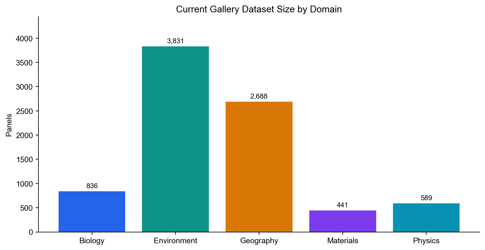
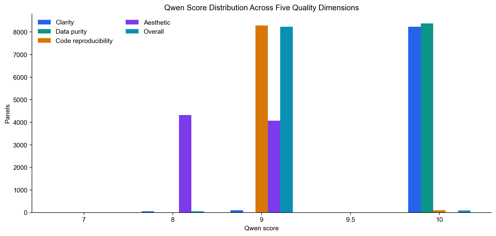
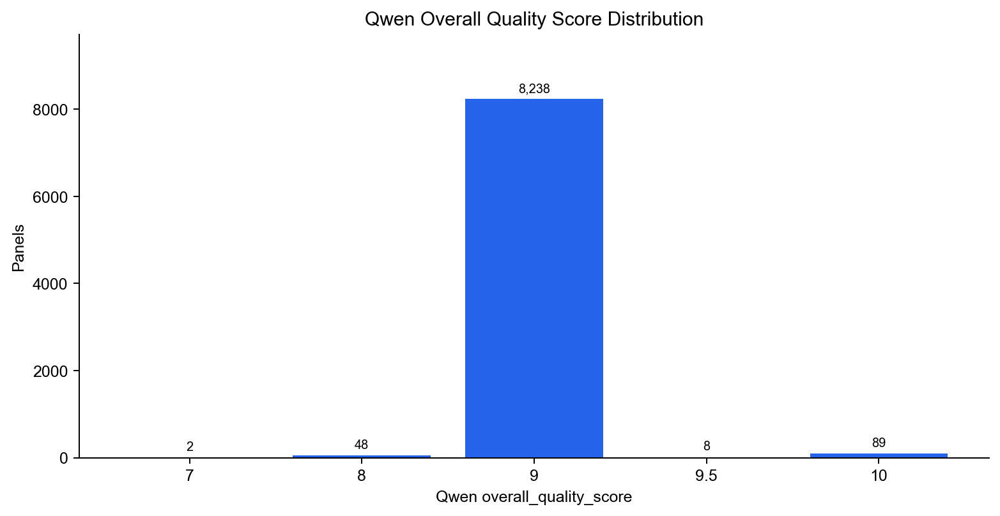
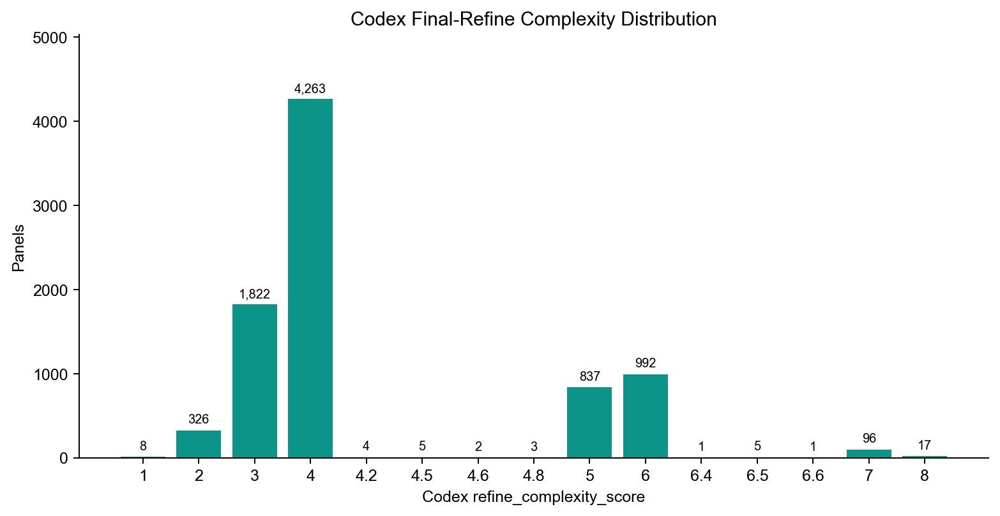

# NaturePanelForge: Introduction and Methods

This document summarizes the current NaturePanelForge dataset snapshot and the workflow used to build it. The statistics below are generated from the formal gallery manifests under `gallery/*/*/manifest.json`; smoke-test exports are excluded.

## Introduction

Scientific figures are dense visual summaries of experimental evidence, statistical comparisons, model behavior, and domain-specific measurements. Unlike ordinary business charts, paper figures often combine multiple subplots, scientific symbols, compact legends, inset axes, colorbars, error bars, statistical annotations, and domain-specific visual idioms. This makes scientific figure-to-code reconstruction a substantially harder task than generic chart-to-code generation.

NaturePanelForge is designed to turn real open-access scientific papers into a panel-level benchmark for editable plotting-code reconstruction. The project starts from Nature-family papers, downloads full-resolution figures, splits multi-panel figures into reviewed panel crops, filters for high-quality statistical/data panels, asks a vision model to score and classify each panel, and then uses Codex agent loops to reproduce and refine the panel as executable Python plotting code.

The final benchmark record is not only an image pair. Each accepted panel preserves source metadata, DOI, journal, publication date, figure and panel labels, caption context, Qwen panel-quality assessment, target image, generated Python code, reproduced PNG/PDF, refined PNG/PDF, Codex review artifacts, final-refine complexity score, and a compact caption-based content summary. The intended benchmark task is therefore scientific panel-to-code: given the target panel and optional metadata/caption, produce runnable plotting code that recreates the panel faithfully and remains editable.

## Current Dataset Snapshot

The current formal gallery contains **8,385** statistical/data panels across five domains. Qwen scores are available for all 8,385 panels, and Codex final-refine complexity assessments are available for 8,382 panels.



| Domain | Panels | Review passed | Qwen scored | Complexity scored | Unique journals | Chart subtypes |
|---|---:|---:|---:|---:|---:|---:|
| Biology | 836 | 787 | 836 | 833 | 15 | 30 |
| Environment | 3,831 | 3,831 | 3,831 | 3,831 | 18 | 29 |
| Geography | 2,688 | 2,688 | 2,688 | 2,688 | 15 | 28 |
| Materials | 441 | 433 | 441 | 441 | 10 | 26 |
| Physics | 589 | 589 | 589 | 589 | 11 | 28 |

The most frequent chart subtypes are multi-line plots, grouped bars, scatter plots, heatmaps, bar charts, box plots, scatter-with-fit panels, dot plots, time series, and other data displays.

| Chart subtype | Count |
|---|---:|
| multi_line | 1,340 |
| grouped_bar | 798 |
| scatter | 727 |
| heatmap | 716 |
| bar | 647 |
| box | 637 |
| scatter_with_fit | 487 |
| dot_plot | 363 |
| time_series | 309 |
| other_data_display | 296 |
| umap_tsne_pca | 252 |
| geospatial_map | 242 |
| line | 235 |
| stacked_bar | 234 |
| violin | 213 |
| histogram | 190 |
| volcano_plot | 114 |
| density | 108 |
| survival_curve | 92 |
| dose_response | 87 |

## Qwen Quality Score Distribution

Qwen is used to classify panels and estimate whether a panel is suitable for code reproduction. The current accepted gallery is intentionally high quality: all panels are classified as `data_statistical`, and all have `data_purity_score = 10`.



The `overall_quality_score` has mean **9.005**, median **9.0**, minimum **7.0**, and maximum **10.0**.



| Qwen metric | Score | Count |
|---|---:|---:|
| clarity_integrity_score | 7 | 2 |
| clarity_integrity_score | 8 | 48 |
| clarity_integrity_score | 9 | 98 |
| clarity_integrity_score | 10 | 8,237 |
| data_purity_score | 10 | 8,385 |
| code_reproducibility_score | 9 | 8,292 |
| code_reproducibility_score | 10 | 93 |
| aesthetic_score | 8 | 4,320 |
| aesthetic_score | 9 | 4,065 |
| overall_quality_score | 7 | 2 |
| overall_quality_score | 8 | 48 |
| overall_quality_score | 9 | 8,238 |
| overall_quality_score | 9.5 | 8 |
| overall_quality_score | 10 | 89 |

## Codex Final-Refine Complexity Distribution

The final-refine stage also records a `refine_complexity_score`, which estimates how difficult it was to polish the reproduced panel after the first reproduction pass. This is not a generic image-complexity score; it reflects code-reproduction and final-polish difficulty, including typography, layout pressure, label/tick/legend overlap, scientific symbols, inset elements, and the amount of code-level correction needed.

For the current snapshot, the score is available for **8,382** panels. The mean is **4.084**, the median is **4.0**, the minimum is **1.0**, and the maximum is **8.0** on the current 1-10 scale.



| refine_complexity_score | Count |
|---:|---:|
| 1 | 8 |
| 2 | 326 |
| 3 | 1,822 |
| 4 | 4,263 |
| 4.2 | 4 |
| 4.5 | 5 |
| 4.6 | 2 |
| 4.8 | 3 |
| 5 | 837 |
| 6 | 992 |
| 6.4 | 1 |
| 6.5 | 5 |
| 6.6 | 1 |
| 7 | 96 |
| 8 | 17 |

## Methods

### 1. Paper Retrieval and Full-Figure Acquisition

The workflow starts from a subject/topic configuration such as biology, environment, geography, materials, or physics. For each domain, the pipeline queries open-access Nature-family papers, records DOI/title/abstract/journal/date metadata, and downloads figure assets from PMC and Nature/Springer full-size image URLs when available. A global pipeline state tracks already collected DOI/PMCID identifiers to reduce duplicate paper retrieval across future runs.

The download stage writes paper-level metadata, full-figure CSV manifests, figure images, and image-wrapped PDFs. These files provide the source context for panel splitting and later allow each panel to be traced back to a DOI, paper, full figure, and caption.

### 2. Panel Split Agent Loop

Full figures are compound scientific images, so the first agentic stage splits each figure into panel-level crops. The panel-splitting Codex loop uses a split agent to propose executable cropping/specification logic and a review agent to audit the result. The review checks panel labels, panel completeness, boundary visibility, axes, ticks, legends, colorbars, titles, and whether any neighboring panels leak into the crop.

The output is a panel directory containing `target.png`/`target.pdf` for each panel plus metadata that links the panel back to the paper and full figure. Review artifacts are preserved to support resume, auditing, and later quality analysis.

### 3. Qwen Panel Classification and Quality Scoring

Each panel is then scored by a local Qwen vision model. The prompt asks Qwen to identify the panel category and statistical subtype, then assign several 0-10 quality metrics:

- `clarity_integrity_score`
- `data_purity_score`
- `code_reproducibility_score`
- `aesthetic_score`
- `overall_quality_score`

The same prompt also checks whether the panel is complete, whether labels or ticks are applicable and complete, and whether the panel is suitable for code-based reproduction. Only statistical/data panels that pass the configured quality gates are forwarded to reproduction.

### 4. Code Reproduce Agent Loop

The reproduction stage converts a target panel into executable plotting code. A code-writing Codex agent creates or edits `reproduce_panel.py`, renders `reproduce_panel.png` and `reproduce_panel.pdf`, and writes run logs. A review Codex agent compares the rendered output with `target.png` and audits chart type, data pattern, layout, axes, ticks, labels, legends, annotations, colors, edge visibility, and obvious collisions.

If the review finds fixable problems, the loop returns to code editing and rerendering. The default production configuration allows multiple review rounds and stores review summaries, notes, raw responses, and prompts. The goal is not raster tracing; the artifact must remain runnable and editable Python code.

### 5. Final Refine Agent Loop

Final refine starts from panels that already have a first-pass reproduction. A polish agent edits the existing code rather than replacing it with an unrelated script. An audit agent then checks typography and layout more strictly, including Arial font consistency, font-size hierarchy, label/tick/legend overlap, scientific symbol rendering, edge clipping, compactness, and remaining differences from the target.

This stage writes refined code/renderings and a `refine_complexity_assessment.json` file containing:

- `refine_complexity_score`
- `complexity_reason`
- `caption_based_content_summary`

The complexity score is used to stratify benchmark difficulty, while the caption-based summary preserves a compact textual description of the scientific content in the panel.

### 6. Gallery Export and Benchmark Record

Accepted panels are exported to the gallery with target images, reproduced/refined images, code, Qwen scores, review summaries, complexity assessments, metadata, and caption context. The gallery is the current inspection interface and the source used for the statistics in this document.

## Reproducing These Statistics

Run the statistics script from the repository root:

```bash
python3 scripts/build_project_intro_stats.py
```

It writes:

```text
docs/assets/dataset_stats/dataset_stats_summary.json
docs/assets/dataset_stats/dataset_subject_counts.csv
docs/assets/dataset_stats/qwen_score_dimension_distribution.csv
docs/assets/dataset_stats/qwen_overall_quality_distribution.csv
docs/assets/dataset_stats/codex_refine_complexity_distribution.csv
docs/assets/dataset_stats/dataset_domain_counts.png
docs/assets/dataset_stats/qwen_score_dimension_distribution.png
docs/assets/dataset_stats/qwen_overall_quality_distribution.png
docs/assets/dataset_stats/codex_refine_complexity_distribution.png
```

